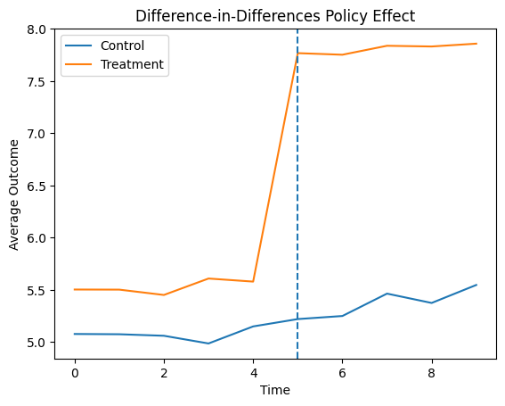

# Difference-in-Differences Policy Evaluation

## Overview

Evaluating the causal impact of public policies is a central problem in applied economics. One of the most widely used empirical strategies in policy evaluation is the Difference-in-Differences (DiD) method.

This project implements a Difference-in-Differences framework to estimate the causal effect of a hypothetical policy intervention using simulated panel data. The objective is to demonstrate how econometric methods used in empirical research can be implemented using Python.

The project illustrates the following workflow:

* Construction of panel data
* Definition of treatment and control groups
* Implementation of Difference-in-Differences regression
* Visualization of policy effects

This repository is part of a research portfolio showcasing applied econometric methods used in policy analysis and causal inference.

---

# Background

The Difference-in-Differences method estimates the causal impact of a policy by comparing changes in outcomes between:

* a **treatment group** affected by the policy
* a **control group** not affected by the policy

before and after the policy intervention.

The standard DiD regression model is:

Outcome_it = α + β₁Treatment_i + β₂Post_t + β₃(Treatment_i × Post_t) + ε_it

Where:

* Treatment_i = indicator for treated units
* Post_t = indicator for post-policy period
* Treatment × Post = policy effect

The coefficient β₃ represents the **causal effect of the policy intervention**.

---

# Dataset

This project generates a simulated panel dataset representing:

* individuals observed over time
* treated and control groups
* a policy intervention occurring at a specific time

Variables include:

* individual identifier
* time period
* treatment indicator
* policy period indicator
* outcome variable

The dataset is saved locally to ensure full reproducibility.

---

# Methodology

## 1. Data Generation

Synthetic panel data is generated to mimic a policy experiment where a subset of individuals is exposed to a treatment after a policy reform.

---

## 2. Policy Definition

The policy intervention is represented by:

Treatment × Post

which captures the change in outcomes for treated individuals after the policy is implemented.

---

## 3. Econometric Model

The policy effect is estimated using ordinary least squares (OLS):

Outcome_it = α + β₁Treatment_i + β₂Post_t + β₃(Treatment_i × Post_t) + ε_it

The coefficient β₃ represents the Difference-in-Differences estimate of the policy effect.

---

# Example Output

Example regression results:

Policy Effect (DiD coefficient): 2.05
p-value: 0.001

Interpretation:

The policy increases the outcome variable by approximately two units for the treated group relative to the control group.

---

# Output

The analysis produces the following visualization showing the difference-in-differences estimate:



*Figure 1: Comparison of parallel trends between the treatment and control groups.*

---

# Project Structure

```
difference-in-differences-policy-evaluation
│
├── data
│
├── results
│
├── did_policy_analysis.py
├── requirements.txt
└── README.md
```

---

# How to Run

Clone repository

```
git clone https://github.com/yourusername/difference-in-differences-policy-evaluation.git
```

Install dependencies

```
pip install -r requirements.txt
```

Run the script

```
python did_policy_analysis.py
```

The script will:

* generate panel data
* estimate the Difference-in-Differences model
* save regression results
* create a visualization of the policy effect

---

# Key Takeaways

This project demonstrates how causal inference methods can be applied to evaluate public policy interventions.

Key insights include:

* Difference-in-Differences isolates causal policy effects using natural experiments
* Panel data methods are widely used in empirical economics
* Econometric models play a crucial role in policy evaluation research

---

# Technologies Used

Python libraries:

* pandas
* numpy
* statsmodels
* matplotlib

---

# Disclaimer

This project is intended for educational and research purposes only.

